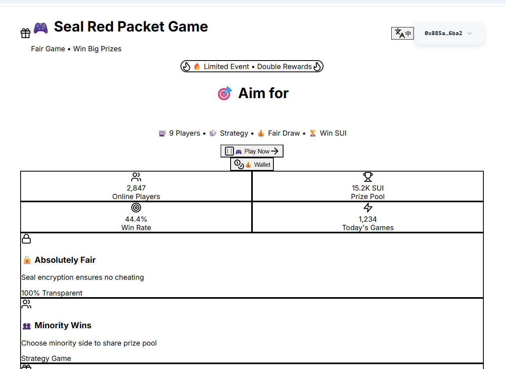

# Seal Red Packet Game

A fair and transparent blockchain-based red packet game built on Sui blockchain with Seal encryption technology.

## 🎮 Game Overview

Seal Red Packet is an innovative multiplayer game where 9 players compete by making secret choices between option A or B. The minority choice wins the entire prize pool, creating an exciting psychological battle.

### Key Features

🔐 **Seal Encryption Technology**
- All player choices are encrypted using Seal technology
- Complete anonymity - no one can see your choice until revelation
- Tamper-proof - choices cannot be changed once submitted
- Verifiable - all encrypted data can be audited on-chain

⚡ **Blockchain-Based Fairness**
- Built on Sui blockchain for transparency
- Smart contracts ensure automatic and fair prize distribution
- No central authority - the game runs autonomously

🎯 **Strategic Gameplay**
- Psychological warfare between players
- Minority wins principle creates interesting dynamics
- Risk vs reward decision making
- Pattern recognition and prediction

## 🎲 How to Play

1. **Join Room**: Enter a game room and stake SUI tokens
2. **Make Choice**: Secretly select between option A or B (encrypted with Seal)
3. **Wait for Others**: All 9 players must complete their choices
4. **Reveal Phase**: Choices are decrypted simultaneously
5. **Determine Winner**: The minority choice (4 or fewer players) wins
6. **Prize Distribution**: Winners split the entire prize pool equally

## 🏆 Winning Strategy

### Game Theory Principles
- **Minority Advantage**: With 9 players, the optimal group size is 4 or fewer
- **Psychological Analysis**: Predict what others might choose
- **Pattern Recognition**: Identify and break common patterns
- **Independent Thinking**: Avoid herd mentality

### Tips for Success
- Observe player behavior in previous rounds
- Consider the current game state and prize pool size
- Make unpredictable choices
- Stay calm under pressure

## 🔧 Technical Architecture

### Frontend
- **React 18** with TypeScript
- **Vite** for fast development and building
- **Tailwind CSS** for responsive design
- **Lucide React** for beautiful icons

### Blockchain Integration
- **@mysten/dapp-kit** for Sui blockchain interaction
- **@mysten/seal** for encryption technology
- **@mysten/sui** for core blockchain operations

### Smart Contract Features
- Automatic prize pool management
- Encrypted choice submission
- Fair random revelation mechanism
- Automatic winner calculation and distribution

## 🚀 Getting Started

### Prerequisites
- Node.js 16+ installed
- Sui wallet browser extension
- Basic understanding of blockchain concepts

### Installation

```bash
# Clone the repository
git clone https://github.com/summertoo/sealred2.git

# Navigate to project directory
cd sealred2

# Install dependencies
npm install

# Start development server
npm run dev

# Build for production
npm run build
```

### Configuration

1. **Network Setup**: Configure Sui network settings in `src/networkConfig.ts`
2. **Wallet Connection**: Ensure Sui wallet extension is installed
3. **Environment Variables**: Set up necessary environment variables

## 🌐 Deployment

### Vercel Deployment
The application is deployed on Vercel for optimal performance:

- **Main Instance**: https://sealredpacket.edgeone.app/
- **Backup Instance**: https://sealred2.vercel.app/

### Build Process
```bash
# Build the application
npm run build

# Preview production build
npm run preview
```

## 🔒 Security Features

### Seal Encryption
- **Zero-Knowledge Proofs**: Choices remain private until revelation
- **Commit-Reveal Scheme**: Two-phase commitment process
- **Cryptographic Security**: Industry-standard encryption algorithms

### Blockchain Security
- **Smart Contract Audits**: Regular security audits of game logic
- **Decentralized Operation**: No single point of failure
- **Transparent Execution**: All transactions visible on-chain

## 🎮 Game Modes

### Demo Mode
- Practice with simulated data
- Learn game mechanics without risk
- Understand encryption process

### Real Money Mode
- Stake actual SUI tokens
- Compete for real prizes
- Experience full game features

## 📊 Game Statistics

### Player Analytics
- Win rate tracking
- Choice pattern analysis
- Performance over time

### Room Statistics
- Prize pool history
- Player participation trends
- Game duration analytics

## 🤝 Contributing

We welcome contributions to improve the Seal Red Packet game!

### Development Workflow
1. Fork the repository
2. Create a feature branch
3. Make your changes
4. Add tests if applicable
5. Submit a pull request

### Code Standards
- TypeScript for type safety
- ESLint for code quality
- Prettier for code formatting
- Conventional commits for version control

## 📄 License

This project is licensed under the MIT License - see the LICENSE file for details.

## 🆘 Support

### Getting Help
- **Documentation**: Check this README and inline code comments
- **Issues**: Report bugs on GitHub Issues
- **Community**: Join our Discord server for discussions

### Common Issues
- **Wallet Connection**: Ensure Sui wallet is properly installed and unlocked
- **Network Errors**: Check your internet connection and Sui network status
- **Transaction Failures**: Verify you have sufficient SUI balance for gas fees

## 🔮 Future Roadmap

### Upcoming Features
- **Mobile App**: Native iOS and Android applications
- **Tournament Mode**: Competitive gameplay with leaderboards
- **NFT Integration**: Unique digital collectibles for winners
- **Multi-Language Support**: Global accessibility improvements

### Technical Improvements
- **Layer 2 Integration**: Faster and cheaper transactions
- **Advanced Analytics**: Enhanced player insights
- **AI Opponents**: Practice against intelligent bots
- **Social Features**: Friend lists and private rooms

---

**Built with ❤️ using Sui blockchain and Seal encryption technology**

test url:
https://sealred2.vercel.app/

